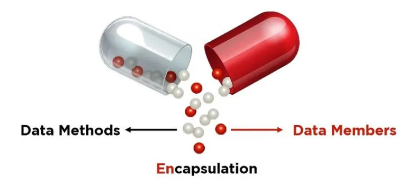
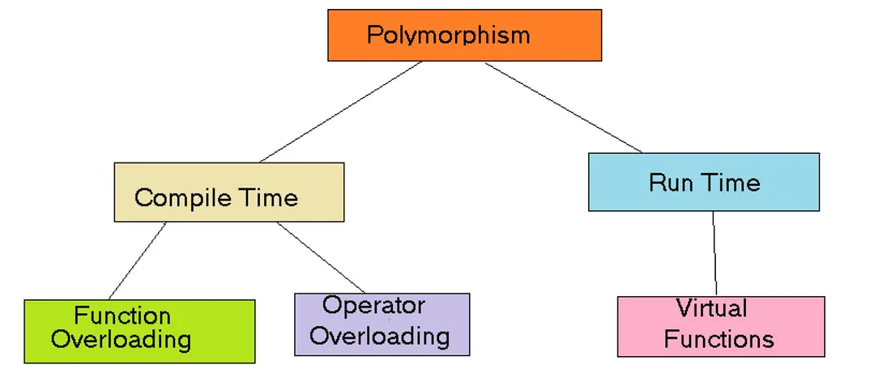
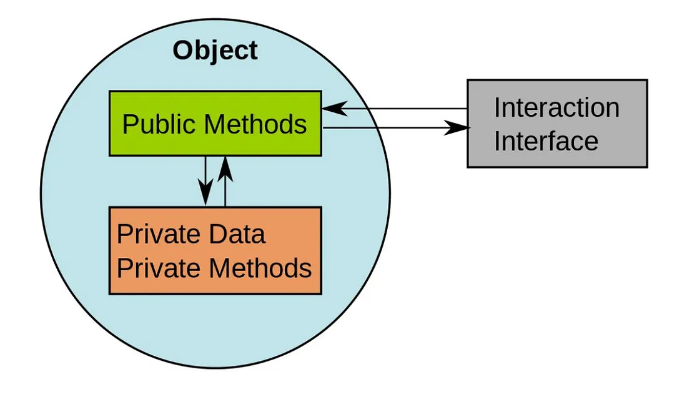
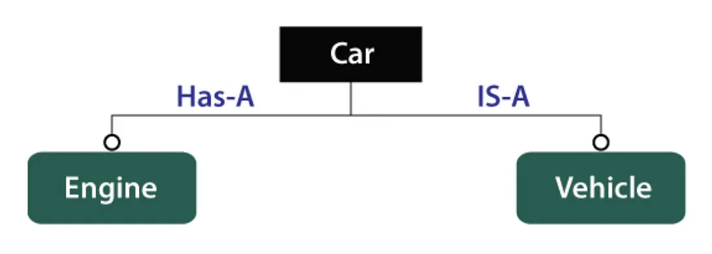
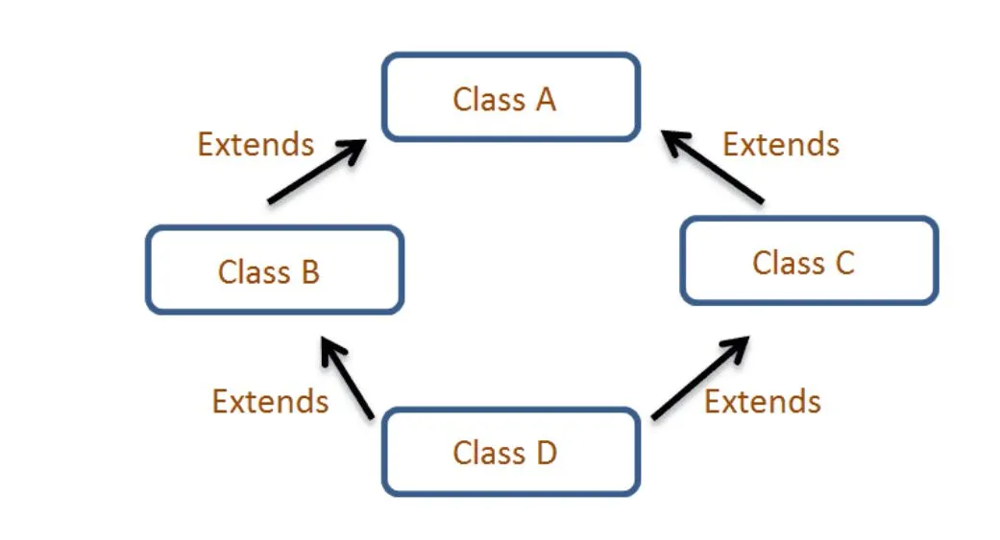
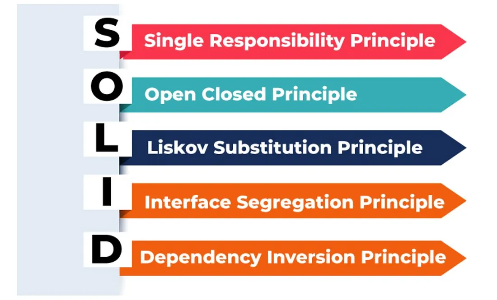

# **🌟 OOPS Concepts Interview Guide**

Welcome to the fascinating world of Object-Oriented Programming (OOP)! Whether you’re a seasoned developer or just stepping into the coding universe, understanding OOP concepts is crucial. In this guide, we’ll explore **25 important OOP interview questions** that unravel the core principles guiding the creation of robust and scalable software. Let’s deep dive into it! 🚀

---

## **📚 Table of Contents**

1. [What is object-oriented programming (OOP)?](#q1-what-is-object-oriented-programming-oop)
2. [What is encapsulation?](#q2-what-is-encapsulation)
3. [What is inheritance?](#q3-what-is-inheritance)
4. [What is polymorphism?](#q4-what-is-polymorphism)
5. [What is a constructor?](#q5-what-is-a-constructor)
6. [What is method overloading?](#q6-what-is-method-overloading)
7. [What is method overriding?](#q7-what-is-method-overriding)
8. [What is an abstract class?](#q8-what-is-an-abstract-class)
9. [What is an interface?](#q9-what-is-an-interface)
10. [What is a static method?](#q10-what-is-a-static-method)
11. [What is a final class?](#q11-what-is-a-final-class)
12. [What is composition?](#q12-what-is-composition)
13. [What is a super keyword?](#q13-what-is-a-super-keyword)
14. [What is method hiding?](#q14-what-is-method-hiding)
15. [What is constructor chaining?](#q15-what-is-constructor-chaining)
16. [What is the diamond problem in multiple inheritance?](#q16-what-is-the-diamond-problem-in-multiple-inheritance)
17. [What is a shallow copy and a deep copy?](#q17-what-is-a-shallow-copy-and-a-deep-copy)
18. [What is a virtual method?](#q18-what-is-a-virtual-method)
19. [How does Java achieve multiple inheritance?](#q19-how-does-java-achieve-multiple-inheritance)
20. [What is the purpose of the final keyword in Java?](#q20-what-is-the-purpose-of-the-final-keyword-in-java)
21. [What is the SOLID principle?](#q21-what-is-the-solid-principle)
22. [What is the difference between an abstract class and an interface?](#q22-what-is-the-difference-between-an-abstract-class-and-an-interface)
23. [How is encapsulation related to data hiding?](#q23-how-is-encapsulation-related-to-data-hiding)
24. [What is the difference between composition and inheritance?](#q24-what-is-the-difference-between-composition-and-inheritance)
25. [What is the role of a destructor in C++?](#q25-what-is-the-role-of-a-destructor-in-c)

### **Q1. What is object-oriented programming (OOP)?**

_Object-Oriented Programming (OOP)_ is a programming paradigm that organizes code into objects, which are instances of classes. It focuses on encapsulating data and behavior together, promoting modularity and reusability.  
[🔝 Back to Top](#📚-table-of-contents)

---

### **Q2. What is encapsulation?**

_Encapsulation_ is the concept of bundling data (attributes) and methods (functions) that operate on that data into a single unit (class). It hides the internal details of an object and provides controlled access through methods.  

[🔝 Back to Top](#📚-table-of-contents)

---

### **Q3. What is inheritance?**

_Inheritance_ is a mechanism where a new class (subclass or derived class) inherits properties and behaviors from an existing class (superclass or base class). It promotes code reuse and supports hierarchical relationships.  
[🔝 Back to Top](#📚-table-of-contents)

---

### **Q4. What is polymorphism?**

_Polymorphism_ allows objects of different classes to be treated as instances of a common superclass. It enables methods to be invoked on objects without knowing their specific types, as long as they adhere to the common interface.  

[🔝 Back to Top](#📚-table-of-contents)

---

### **Q5. What is a constructor?**

A _constructor_ is a special method that is automatically called when an object is created. It initializes the object’s attributes and prepares the object for use. Constructors often have the same name as the class.  
[🔝 Back to Top](#📚-table-of-contents)

---

### **Q6. What is method overloading?**

_Method overloading_ is a feature that allows a class to have more than one method with the same name, as long as their parameter lists are different. The methods are differentiated by the number and types of parameters.  
[🔝 Back to Top](#📚-table-of-contents)

---

### **Q7. What is method overriding?**

_Method overriding_ occurs when a subclass provides a specific implementation for a method that is already defined in its superclass. The overridden method has the same name, return type, and parameters as the superclass method.  
[🔝 Back to Top](#📚-table-of-contents)

---

### **Q8. What is an abstract class?**

An _abstract class_ is a class that cannot be instantiated and may contain abstract methods (methods without a body). Subclasses of the abstract class must provide implementations for its abstract methods.  
[🔝 Back to Top](#📚-table-of-contents)

---

### **Q9. What is an interface?**

An _interface_ is a contract that specifies methods that a class must implement. It allows multiple classes to adhere to the same interface and promotes loose coupling between components.  

[🔝 Back to Top](#📚-table-of-contents)

---

### **Q10. What is a static method?**

A _static method_ belongs to the class itself rather than any object of the class. It can be called without creating an instance of the class and is commonly used for utility or helper methods.  
[🔝 Back to Top](#📚-table-of-contents)

---

### **Q11. What is a final class?**

A _final class_ is a class that cannot be subclassed. It is used to prevent inheritance and to ensure that the implementation of the class remains unchanged.  
[🔝 Back to Top](#📚-table-of-contents)

---

### **Q12. What is composition?**

_Composition_ is a design principle where one class contains objects of other classes as part of its attributes. It is a "has-a" relationship and is used to build complex objects from simpler ones.  

[🔝 Back to Top](#📚-table-of-contents)

---

### **Q13. What is the super keyword?**

The _super_ keyword is used to refer to the superclass of the current object. It can be used to invoke the superclass’s methods or constructor from a subclass.  
[🔝 Back to Top](#📚-table-of-contents)

---

### **Q14. What is method hiding?**

_Method hiding_ occurs when a subclass defines a static method with the same name as a static method in its superclass. The subclass method hides the superclass method rather than overriding it.  
[🔝 Back to Top](#📚-table-of-contents)

---

### **Q15. What is constructor chaining?**

_Constructor chaining_ refers to calling one constructor from another within the same class or between a subclass and superclass. This technique is used to achieve code reuse in constructors.  
[🔝 Back to Top](#📚-table-of-contents)

---

### **Q16. What is the diamond problem in multiple inheritance?**

The _diamond problem_ arises in multiple inheritance scenarios when a class inherits from two classes that both inherit from a common superclass. This can lead to ambiguity in method resolution.  
[🔝 Back to Top](#📚-table-of-contents)

---

### **Q17. What is a shallow copy and a deep copy?**

A _shallow copy_ copies the references of the objects contained within the original object, while a _deep copy_ creates new instances of the contained objects. Deep copying ensures complete duplication, including nested objects.  
[🔝 Back to Top](#📚-table-of-contents)

---

### **Q18. What is a virtual method?**

A _virtual method_ is a method declared in a base class that can be overridden in derived classes. The implementation invoked is determined by the runtime type of the object, supporting polymorphism.  
[🔝 Back to Top](#📚-table-of-contents)

---

### **Q19. How does Java achieve multiple inheritance?**

_Java achieves multiple inheritance_ through the use of interfaces. A class can implement multiple interfaces, allowing it to inherit method signatures from various sources.  

[🔝 Back to Top](#📚-table-of-contents)

---

### **Q20. What is the purpose of the final keyword in Java?**

The _final keyword_ in Java is used to restrict the user. It can be applied to classes, methods, and variables. A final class cannot be subclassed, a final method cannot be overridden, and a final variable cannot be reassigned.  
[🔝 Back to Top](#📚-table-of-contents)

---

### **Q21. What is the SOLID principle?**

The _SOLID principles_ are a set of design principles aimed at making software designs more understandable, flexible, and maintainable. They include Single Responsibility, Open/Closed, Liskov Substitution, Interface Segregation, and Dependency Inversion.  

[🔝 Back to Top](#📚-table-of-contents)

---

### **Q22. What is the difference between an abstract class and an interface?**

An _abstract class_ can have both abstract and concrete methods, while an _interface_ can only have method declarations (until Java 8 where default methods were introduced). Abstract classes can have instance variables, but interfaces cannot.  
[🔝 Back to Top](#📚-table-of-contents)

---

### **Q23. How is encapsulation related to data hiding?**

_Encapsulation_ facilitates _data hiding_ by restricting direct access to an object's data and exposing it through controlled methods, ensuring the integrity and security of the object's state.  
[🔝 Back to Top](#📚-table-of-contents)

---

### **Q24. What is the difference between composition and inheritance?**

_Composition_ is a "has-a" relationship where one class contains objects of another, while _inheritance_ is an "is-a" relationship where one class extends another. Composition provides more flexibility and reduces coupling.  
[🔝 Back to Top](#📚-table-of-contents)

---

### **Q25. What is the role of a destructor in C++?**

A _destructor_ is a special method that is automatically invoked when an object is destroyed. It is used to clean up resources like memory, file handles, or database connections. In C++, the destructor has the same name as the class, prefixed by a tilde (~).  
[🔝 Back to Top](#📚-table-of-contents)

---

## **📝 Practice Problems**

---

### **Problem 1: Hotel Management System (Inheritance, Polymorphism, Design Patterns) 🏨**

**Scenario:**  
You are tasked with building a hotel management system that deals with different types of rooms (like Deluxe, Suite, and Standard) and services (like Food Service and Cleaning Service). Each room has unique properties (like room size, amenities) and services. Implement this system with proper use of **inheritance** and **polymorphism**. Also, use a **design pattern** to manage the allocation of rooms efficiently.

#### Requirements:

- Implement the `Room` base class and derive specific room types (`Deluxe`, `Suite`, `Standard`).
- Implement a `Service` base class and derive specific service types (`FoodService`, `CleaningService`).
- Use the **Factory Design Pattern** for creating room objects based on the room type requested by the user.

🛠️ **Ensure**:

- Each room type has its unique properties.
- Services are applied **polymorphically** to different room types.
- Room allocation is handled by a `RoomFactory`.

---

### **Problem 2: Vehicle Fleet Management System (Abstraction, Interface, Strategy Pattern) 🚚**

**Scenario:**  
Develop a vehicle fleet management system for a logistics company. The company manages different types of vehicles (like **Truck**, **Van**, **Motorbike**) to deliver different types of packages (like fragile goods, electronics, perishable items). Each vehicle uses different **delivery strategies** based on their capacities and the type of package. Implement this system using **interfaces**, **inheritance**, and the **Strategy Design Pattern** to define the delivery behavior dynamically.

#### Requirements:

- Define a `Vehicle` interface with abstract methods for delivering packages.
- Create `Truck`, `Van`, and `Motorbike` classes that implement the `Vehicle` interface.
- Implement different **delivery strategies** for fragile and perishable goods.
- Use the **Strategy Pattern** to assign different delivery behaviors based on the type of goods.

---
